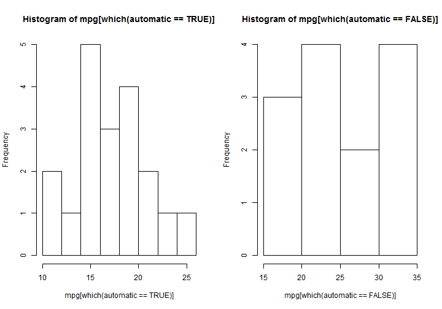

Motor Trend - Bastiaan Quast
========================================================
Executive Summary
--------------------------------------------------------
We look at, we find.

Analysis
--------------------------------------------------------
We start by loading the **mtcars** data frame and inspecting the data. Recode to a logical **automatic** variable, and inspect the relevant variables.


```r
data( mtcars )
mtcars$automatic <- mtcars$am == 0
attach( mtcars )
summary( mpg )
```

```
##    Min. 1st Qu.  Median    Mean 3rd Qu.    Max. 
##    10.4    15.4    19.2    20.1    22.8    33.9
```

```r
summary( automatic )
```

```
##    Mode   FALSE    TRUE    NA's 
## logical      13      19       0
```

Some plots.


```r
par( mfrow=c(1,2) )
hist( mpg[which(automatic == TRUE)] )
hist( mpg[which(automatic == FALSE)] )
```

 

Estimate the base model.

```r
mpg.auto <- lm( mpg ~ automatic, data=mtcars )
summary( mpg.auto )
```

```
## 
## Call:
## lm(formula = mpg ~ automatic, data = mtcars)
## 
## Residuals:
##    Min     1Q Median     3Q    Max 
## -9.392 -3.092 -0.297  3.244  9.508 
## 
## Coefficients:
##               Estimate Std. Error t value Pr(>|t|)    
## (Intercept)      24.39       1.36   17.94  < 2e-16 ***
## automaticTRUE    -7.24       1.76   -4.11  0.00029 ***
## ---
## Signif. codes:  0 '***' 0.001 '**' 0.01 '*' 0.05 '.' 0.1 ' ' 1
## 
## Residual standard error: 4.9 on 30 degrees of freedom
## Multiple R-squared:  0.36,	Adjusted R-squared:  0.338 
## F-statistic: 16.9 on 1 and 30 DF,  p-value: 0.000285
```

```r
plot( mpg, automatic )
```

 

```r
hist( mpg.auto$residuals )
```

 

Include likely covariates (a.k.a. control variables).


```r
cov.mpg.am <- lm( mpg ~ am + wt + disp, data=mtcars )
summary( cov.mpg.am )
```

```
## 
## Call:
## lm(formula = mpg ~ am + wt + disp, data = mtcars)
## 
## Residuals:
##    Min     1Q Median     3Q    Max 
## -3.489 -2.411 -0.723  1.750  6.329 
## 
## Coefficients:
##             Estimate Std. Error t value Pr(>|t|)    
## (Intercept) 34.67591    3.24061   10.70  2.1e-11 ***
## am           0.17772    1.48432    0.12    0.906    
## wt          -3.27904    1.32751   -2.47    0.020 *  
## disp        -0.01780    0.00937   -1.90    0.068 .  
## ---
## Signif. codes:  0 '***' 0.001 '**' 0.01 '*' 0.05 '.' 0.1 ' ' 1
## 
## Residual standard error: 2.97 on 28 degrees of freedom
## Multiple R-squared:  0.781,	Adjusted R-squared:  0.758 
## F-statistic: 33.3 on 3 and 28 DF,  p-value: 2.25e-09
```
